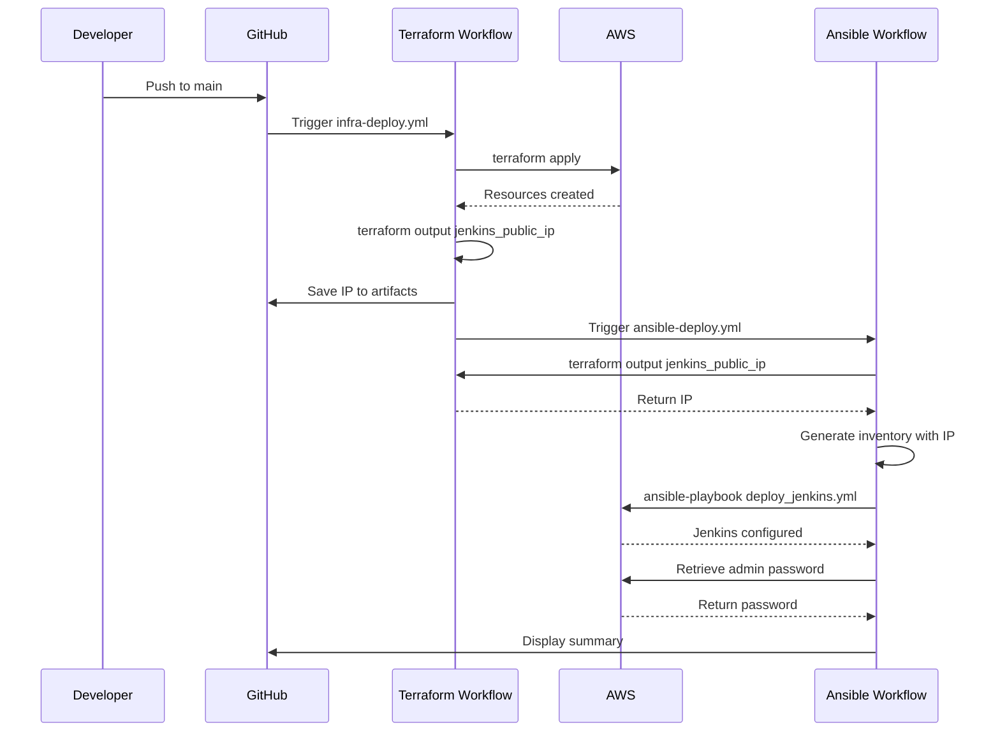

# Automation Guide: Dynamic Terraform + Ansible Integration

This guide explains the automated deployment pipeline that dynamically integrates Terraform infrastructure provisioning with Ansible configuration management.

## Table of Contents
- [Overview](#overview)
- [Architecture](#architecture)
- [GitHub Actions Workflows](#github-actions-workflows)
- [Local Development](#local-development)
- [Troubleshooting](#troubleshooting)

## Overview

The automation eliminates manual configuration by:
1. **Dynamically fetching** Jenkins IP from Terraform outputs
2. **Auto-generating** Ansible inventory at runtime
3. **Triggering** Ansible deployment after Terraform completes
4. **Eliminating** hardcoded IPs and manual inventory updates

## Architecture

### Data Flow

```
┌─────────────────────────────────────────────────────────────────┐
│                    GitHub Actions Pipeline                      │
├─────────────────────────────────────────────────────────────────┤
│                                                                 │
│  ┌──────────────────────────────────────────────────────────┐  │
│  │  STEP 1: Terraform Deploy Workflow                       │  │
│  │  (.github/workflows/infra-deploy.yml)                    │  │
│  │                                                           │  │
│  │  1. terraform init                                        │  │
│  │  2. terraform plan                                        │  │
│  │  3. terraform apply                                       │  │
│  │  4. terraform output -raw jenkins_public_ip  ────────┐   │  │
│  │  5. Save outputs to artifacts                        │   │  │
│  └──────────────────────────────────────────────────────│───┘  │
│                                                          │      │
│                                                          │      │
│  ┌──────────────────────────────────────────────────────│───┐  │
│  │  STEP 2: Ansible Deploy Workflow                     ▼   │  │
│  │  (.github/workflows/ansible-deploy.yml)                  │  │
│  │                                                           │  │
│  │  1. terraform init (access remote state)                 │  │
│  │  2. terraform output -raw jenkins_public_ip              │  │
│  │  3. Generate inventory dynamically                       │  │
│  │     [jenkins]                                             │  │
│  │     jenkins_server ansible_host=<DYNAMIC_IP>             │  │
│  │  4. ansible-playbook deploy_jenkins.yml                  │  │
│  │  5. Retrieve Jenkins admin password                      │  │
│  └──────────────────────────────────────────────────────────┘  │
│                                                                 │
└─────────────────────────────────────────────────────────────────┘
```

### Key Components

| Component | Purpose | Location |
|-----------|---------|----------|
| **Terraform Outputs** | Exposes Jenkins IP and instance ID | `infra/terraform/outputs.tf` |
| **Infra Workflow** | Provisions AWS resources | `.github/workflows/infra-deploy.yml` |
| **Ansible Workflow** | Configures Jenkins | `.github/workflows/ansible-deploy.yml` |
| **Dynamic Script** | Local Ansible wrapper | `ansible-run.sh` |

## GitHub Actions Workflows

### Terraform Deploy Workflow

**Trigger Events:**
- Push to `main` or `dev` branch (paths: `terraform/**`)
- Manual workflow dispatch

**Key Steps:**
```yaml
# After terraform apply completes:
- name: Capture Terraform Outputs
  run: |
    JENKINS_IP=$(terraform output -raw jenkins_public_ip)
    echo "jenkins_ip=${JENKINS_IP}" >> $GITHUB_OUTPUT

- name: Upload Terraform Outputs
  uses: actions/upload-artifact@v4
  with:
    name: terraform-outputs-${{ github.sha }}
    path: outputs/
```

**Outputs:**
- Jenkins public IP saved to GitHub artifacts
- Deployment summary in workflow UI

### Ansible Deploy Workflow

**Trigger Events:**
- `workflow_run` - Automatically after Terraform workflow completes
- Push to `main` or `dev` branch (paths: `ansible/**`)
- Manual workflow dispatch

**Key Steps:**
```yaml
# Fetch Jenkins IP dynamically from Terraform state
- name: Terraform Init
  run: terraform init -backend-config="bucket=${{ secrets.TF_BACKEND_BUCKET }}"

- name: Get Jenkins IP from Terraform
  run: |
    JENKINS_IP=$(terraform output -raw jenkins_public_ip)
    echo "jenkins_ip=${JENKINS_IP}" >> $GITHUB_OUTPUT

# Generate inventory at runtime
- name: Build Ansible Inventory
  run: |
    echo "[jenkins]" > ansible/inventory/hosts.ini
    echo "jenkins_server ansible_host=${{ steps.tf_outputs.outputs.jenkins_ip }} ..." >> ansible/inventory/hosts.ini
```

**Outputs:**
- Jenkins access URL
- Initial admin password

### Workflow Sequence



## Local Development

### Prerequisites

1. Terraform state must exist (run `terraform apply` first)
2. AWS credentials configured
3. SSH key available for EC2 access

### Using ansible-run.sh

The `ansible-run.sh` script provides the same dynamic behavior locally:

#### Basic Usage

```bash
# Test connectivity
./ansible-run.sh -m ping

# Check uptime
./ansible-run.sh -m shell -a "uptime"

# Get system info
./ansible-run.sh -m setup
```

#### Running Playbooks

```bash
# Run Jenkins deployment playbook
./ansible-run.sh --playbook ansible/playbooks/deploy_jenkins.yml

# Run with verbose output
./ansible-run.sh --playbook ansible/playbooks/deploy_jenkins.yml -vvv

# Run specific tags
./ansible-run.sh --playbook ansible/playbooks/deploy_jenkins.yml --tags "install"
```

#### Advanced Usage

```bash
# Custom SSH key location
SSH_KEY_PATH=~/.ssh/my-custom-key.pem ./ansible-run.sh -m ping

# Different Terraform directory (if needed)
cd /path/to/project
./ansible-run.sh -m ping

# Check the generated inventory
./ansible-run.sh -m ping && cat ansible/inventory/hosts.ini
```

### Script Behavior

The script automatically:
1. Changes to Terraform directory: `cd infra/terraform`
2. Fetches Jenkins IP: `terraform output -raw jenkins_public_ip`
3. Generates inventory: `ansible/inventory/hosts.ini`
4. Runs your Ansible command with the dynamic inventory

### Generated Inventory Format

```ini
[jenkins]
jenkins_server ansible_host=<DYNAMIC_IP> ansible_user=ubuntu ansible_ssh_private_key_file=~/.ssh/jenkins-key.pem

[jenkins:vars]
ansible_ssh_common_args='-o StrictHostKeyChecking=no'
```

## Troubleshooting

### Issue: "No Terraform state found"

**Symptom:**
```
Error: No Terraform state found. Please run 'terraform apply' first.
```

**Solution:**
```bash
cd infra/terraform
terraform init
terraform apply
cd ../..
./ansible-run.sh -m ping
```

### Issue: "Could not retrieve Jenkins public IP"

**Symptom:**
```
Error: Could not retrieve Jenkins public IP from Terraform outputs
```

**Causes & Solutions:**
1. **Missing output definition**
   - Check `infra/terraform/outputs.tf` contains `jenkins_public_ip`
   - Re-apply: `cd infra/terraform && terraform apply`

2. **Instance not created**
   - Verify EC2 instance exists: `terraform show | grep public_ip`

3. **Wrong Terraform directory**
   - Ensure you're in project root when running `./ansible-run.sh`

### Issue: Ansible workflow fails in GitHub Actions

**Symptom:**
Ansible workflow cannot fetch Jenkins IP

**Solutions:**
1. **Verify GitHub Secrets are configured:**
   ```
   AWS_ACCESS_KEY_ID
   AWS_SECRET_ACCESS_KEY
   AWS_REGION
   TF_BACKEND_BUCKET
   TF_DYNAMODB_TABLE
   SSH_PRIVATE_KEY
   ```

2. **Check Terraform backend configuration:**
   - Ensure remote state is accessible
   - Verify S3 bucket and DynamoDB table exist

3. **Verify workflow trigger:**
   - Check `.github/workflows/ansible-deploy.yml` has correct `workflow_run` trigger
   - Ensure Terraform workflow name matches exactly

### Issue: SSH connection fails

**Symptom:**
```
UNREACHABLE! => {"changed": false, "msg": "Failed to connect via ssh"}
```

**Solutions:**
1. **Verify SSH key:**
   ```bash
   # Local development
   SSH_KEY_PATH=~/.ssh/correct-key.pem ./ansible-run.sh -m ping
   ```

2. **Check security group:**
   ```bash
   # Verify your IP is allowed for SSH
   aws ec2 describe-security-groups --group-ids <sg-id>
   ```

3. **Verify instance is running:**
   ```bash
   cd infra/terraform
   terraform show | grep instance_state
   ```

### Issue: Inventory file format errors

**Symptom:**
```
ssh: Could not resolve hostname ansible_user=ubuntu
```

**Cause:** Incorrect inventory file format

**Solution:**
The script automatically generates correct format. If manually editing:
```ini
# CORRECT ✓
jenkins_server ansible_host=1.2.3.4 ansible_user=ubuntu

# INCORRECT ✗
ansible_user=ubuntu ansible_host=1.2.3.4
```

## Best Practices

### For GitHub Actions

1. **Use remote state** - Store Terraform state in S3 with DynamoDB locking
2. **Protect secrets** - Never commit AWS credentials or SSH keys
3. **Use environments** - Configure GitHub environments for production approval gates
4. **Monitor workflows** - Set up notifications for workflow failures

### For Local Development

1. **Never commit inventory files** - The `hosts.ini` is auto-generated
2. **Use the wrapper script** - Avoid running ansible commands directly
3. **Keep state synchronized** - Run `terraform apply` before Ansible commands
4. **Use descriptive tags** - Tag your infrastructure for easier management

### Security Considerations

1. **Restrict SSH access** - Use specific IP ranges in security groups
2. **Rotate credentials** - Regularly update AWS access keys and SSH keys
3. **Enable MFA** - Use multi-factor authentication for AWS console access
4. **Review IAM policies** - Follow principle of least privilege
5. **Encrypt sensitive data** - Use AWS Secrets Manager for credentials

## Summary

This automated pipeline provides:
- **Zero manual configuration** - No hardcoded IPs or manual inventory updates
- **Single source of truth** - Terraform state drives Ansible configuration
- **Consistent deployments** - Same process locally and in CI/CD
- **Error prevention** - No configuration drift or stale inventory files
- **Fast iteration** - Quick feedback loop for infrastructure changes

For questions or issues, refer to the main [README.md](README.md) or open an issue on GitHub.
