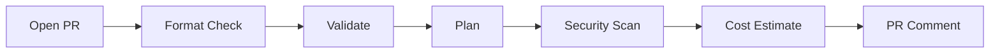
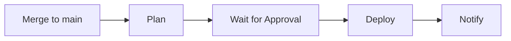
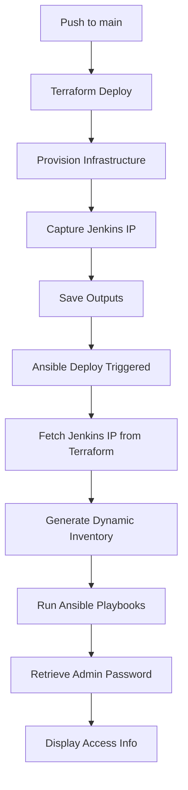

# Jenkins Server Terraform Infrastructure

Deploy a production-ready Jenkins CI/CD server on AWS with automated workflows, security scanning, and approval gates.

## 🚀 Quick Start

terraform/
├── modules/
│   ├── vpc/                        # VPC with public/private subnets, IGW, route tables
│   │   ├── main.tf
│   │   ├── variables.tf
│   │   └── outputs.tf
│   ├── security_group/             # Security group management
│   │   ├── main.tf
│   │   ├── variables.tf
│   │   └── outputs.tf
│   ├── ec2_jenkins/                # Jenkins EC2 instance
│   │   ├── main.tf
│   │   ├── variables.tf
│   │   ├── outputs.tf
│   │   └── scripts/
│   │       └── jenkins_install.sh
│   ├── s3_bucket/                  # S3 bucket for artifacts
│   │   ├── main.tf
│   │   ├── variables.tf
│   │   └── outputs.tf
│   ├── iam_role/                   # IAM roles and instance profiles
│   │   ├── main.tf
│   │   ├── variables.tf
│   │   └── outputs.tf
│   ├── kms/                        # KMS keys for encryption
│   │   ├── main.tf
│   │   ├── variables.tf
│   │   └── outputs.tf
│   └── nat_instance/               # NAT instance for private subnet internet access
│       ├── main.tf
│       ├── variables.tf
│       └── outputs.tf
├── providers.tf
├── backend.tf
├── variables.tf
├── main.tf
└── outputs.tf

**New to this project?** → See **[QUICK-START.md](QUICK-START.md)**

**Setting up CI/CD?** → See **[WORKFLOWS.md](WORKFLOWS.md)**

**Deploying manually?** → See **[DEPLOYMENT-GUIDE.md](DEPLOYMENT-GUIDE.md)**

## ✨ Key Features

- ✅ **Automated CI/CD** - Deploy on PR merge with approval gates
- ✅ **Security Scanning** - tfsec + Checkov on every PR
- ✅ **Production Ready** - Least privilege IAM, KMS encryption, monitoring
- ✅ **Cost Optimized** - ~$150/month for production (free tier available)
- ✅ **Well Documented** - Comprehensive guides for all scenarios

## 📋 CI/CD Workflow

This repository uses **decomposed workflows** for better control:

### Pull Request Workflow


- Runs on all PRs affecting `terraform/**`
- Validates changes without deploying
- Posts plan, security results, and cost to PR
- No infrastructure changes made

### Deployment Workflow


- Runs on merge to `main`
- Requires manual approval (production environment)
- Deploys infrastructure changes
- Provides Jenkins URL in output

See **[WORKFLOWS.md](WORKFLOWS.md)** for detailed workflow documentation.

## 🔄 Automated Deployment Flow

This project features a **fully automated deployment pipeline** that dynamically integrates Terraform and Ansible:

### How It Works

1. **Terraform Deploy** (`.github/workflows/infra-deploy.yml`)
   - Provisions AWS infrastructure (VPC, EC2, Security Groups, etc.)
   - Captures Jenkins public IP from Terraform outputs
   - Saves outputs as GitHub artifacts
   - Displays deployment summary with Jenkins URL

2. **Ansible Deploy** (`.github/workflows/ansible-deploy.yml`)
   - Automatically triggers after Terraform deployment completes
   - Dynamically fetches Jenkins IP from Terraform state (no hardcoded IPs!)
   - Generates Ansible inventory at runtime
   - Configures Jenkins with Ansible playbooks
   - Retrieves and displays initial admin password

### Workflow Integration



### Local Development with Dynamic IP

For local testing, use the provided `ansible-run.sh` wrapper script:

```bash
# Run Ansible ping test
./ansible-run.sh -m ping

# Run Ansible playbook
./ansible-run.sh --playbook ansible/playbooks/deploy_jenkins.yml

# Run ad-hoc command with verbose output
./ansible-run.sh -m shell -a "uptime" -v

# Use custom SSH key
SSH_KEY_PATH=~/.ssh/my-key.pem ./ansible-run.sh -m ping
```

The script automatically:
- Fetches the current Jenkins IP from Terraform state
- Generates the Ansible inventory dynamically
- Runs your Ansible command with the correct configuration

**Benefits:**
- No manual IP updates needed
- Works seamlessly after Terraform apply
- Single source of truth (Terraform state)
- Eliminates configuration drift

### Required GitHub Secrets

For the automated workflows to function, configure these secrets in your repository:

| Secret | Description |
|--------|-------------|
| `AWS_ACCESS_KEY_ID` | AWS credentials for Terraform/Ansible |
| `AWS_SECRET_ACCESS_KEY` | AWS credentials for Terraform/Ansible |
| `AWS_REGION` | AWS region (e.g., `us-east-1`) |
| `TF_BACKEND_BUCKET` | S3 bucket for Terraform state |
| `TF_DYNAMODB_TABLE` | DynamoDB table for state locking |
| `SSH_PRIVATE_KEY` | SSH private key for EC2 access |

**Note:** `JENKINS_HOST_IP` secret is no longer needed - the IP is fetched dynamically!

## Overview

This Terraform project provisions a complete Jenkins infrastructure on AWS, including:
- **Custom VPC** with public and private subnets across multiple availability zones
- **Jenkins EC2 Instance** running on Amazon Linux 2
- **NAT Instance** for private subnet internet access (optional)
- **Security Groups** for network access control (SSH, Jenkins UI)
- **IAM Role & Instance Profile** for secure S3 access
- **S3 Bucket** for Jenkins artifacts storage with encryption
- **KMS Keys** for EBS encryption
- **Automated Installation** via user data script

The infrastructure is organized using a modular architecture for reusability and maintainability.

## Architecture

```
┌──────────────────────────────────────────────────────────────────────┐
│                       AWS Cloud (us-east-1)                          │
│                                                                      │
│  ┌────────────────────────────────────────────────────────────────┐ │
│  │                    Custom VPC (10.0.0.0/16)                    │ │
│  │                                                                │ │
│  │  ┌──────────────────┐         ┌──────────────────┐            │ │
│  │  │  Public Subnet   │         │  Public Subnet   │            │ │
│  │  │  10.0.1.0/24     │         │  10.0.2.0/24     │            │ │
│  │  │                  │         │                  │            │ │
│  │  │  ┌────────────┐  │         │  ┌────────────┐  │            │ │
│  │  │  │  Jenkins   │  │         │  │ NAT Instance│ │            │ │
│  │  │  │  EC2       │  │         │  │ (Optional) │  │            │ │
│  │  │  │  Instance  │  │         │  │            │  │            │ │
│  │  │  └────────────┘  │         │  └────────────┘  │            │ │
│  │  └──────────────────┘         └──────────────────┘            │ │
│  │         │                              │                       │ │
│  │         │      Internet Gateway        │                       │ │
│  │         └──────────────┬───────────────┘                       │ │
│  │                        │                                       │ │
│  │  ┌──────────────────────────────────────┐                     │ │
│  │  │         Private Subnets              │                     │ │
│  │  │   (Optional - for future expansion)  │                     │ │
│  │  └──────────────────────────────────────┘                     │ │
│  └────────────────────────────────────────────────────────────────┘ │
│                                                                      │
│  ┌────────────────────────────────────────────────────────┐         │
│  │  Supporting Resources                                  │         │
│  │  - S3 Bucket (Jenkins Artifacts, Encrypted)            │         │
│  │  - KMS Key (EBS Encryption)                            │         │
│  │  - IAM Role & Instance Profile (S3 Access)             │         │
│  │  - Security Groups (SSH, Jenkins Web UI)               │         │
│  └────────────────────────────────────────────────────────┘         │
└──────────────────────────────────────────────────────────────────────┘
```

## Module Structure

```
terraform/
├── main.tf                          # Root module - orchestrates modules
├── variables.tf                     # Root-level input variables
├── outputs.tf                       # Root-level outputs
├── providers.tf                     # AWS provider configuration
├── backend.tf                       # Remote backend configuration
└── modules/
    ├── vpc/                         # VPC infrastructure module
    │   ├── main.tf                  # VPC, subnets, IGW, route tables
    │   ├── variables.tf             # VPC configuration inputs
    │   └── outputs.tf               # VPC IDs and subnet information
    ├── security_group/              # Security group module
    │   ├── main.tf                  # Security group rules
    │   ├── variables.tf             # Ingress/egress rule inputs
    │   └── outputs.tf               # Security group ID
    ├── ec2_jenkins/                 # Jenkins EC2 instance module
    │   ├── main.tf                  # EC2 instance configuration
    │   ├── variables.tf             # Instance inputs
    │   ├── outputs.tf               # Instance ID and public IP
    │   └── scripts/
    │       └── jenkins_install.sh   # Jenkins installation script
    ├── s3_bucket/                   # S3 bucket module
    │   ├── main.tf                  # S3 bucket with versioning, encryption
    │   ├── variables.tf             # Bucket configuration inputs
    │   └── outputs.tf               # Bucket name and ARN
    ├── iam_role/                    # IAM role and policy module
    │   ├── main.tf                  # IAM role, policy, instance profile
    │   ├── variables.tf             # Role configuration inputs
    │   └── outputs.tf               # Role ARN and instance profile
    ├── kms/                         # KMS encryption key module
    │   ├── main.tf                  # KMS key and alias
    │   ├── variables.tf             # Key configuration inputs
    │   └── outputs.tf               # Key ID and ARN
    └── nat_instance/                # NAT instance module
        ├── main.tf                  # NAT instance for private subnets
        ├── variables.tf             # NAT configuration inputs
        └── outputs.tf               # NAT instance network interface ID
```

## Prerequisites

Before deploying this infrastructure, ensure you have:

1. **Terraform** >= 1.2 installed ([Download](https://www.terraform.io/downloads))
2. **AWS CLI** configured with valid credentials ([Setup Guide](https://docs.aws.amazon.com/cli/latest/userguide/cli-chap-configure.html))
3. **AWS Account** with appropriate permissions:
   - EC2 (create instances, security groups)
   - IAM (create roles, policies, instance profiles)
   - S3 (create buckets)
   - VPC (create VPCs, subnets, internet gateways, route tables)
   - KMS (create and manage encryption keys)
4. **SSH Key Pair** created in AWS for instance access
5. **Your Public IP** in CIDR format (find with `curl ifconfig.me`)

## Remote State Backend (Optional)

For production use and team collaboration, configure remote state storage using S3 with DynamoDB locking.

### Benefits of Remote State

- **Team Collaboration**: Multiple team members can work on the same infrastructure
- **State Locking**: Prevents concurrent modifications that could corrupt state
- **State History**: S3 versioning provides automatic state history
- **Security**: Encrypted state storage in S3
- **Disaster Recovery**: State is backed up and recoverable

For detailed backend documentation, see [BACKEND.md](./terraform/BACKEND.md).

### Backend Setup

1. **Edit the setup script with your values:**
   ```bash
   vim terraform/setup-backend.sh
   # Update BUCKET_NAME with a globally unique name
   ```

2. **Run the setup script:**
   ```bash
   cd terraform
   ./setup-backend.sh
   ```

   This creates:
   - S3 bucket with versioning, encryption, and public access blocking
   - DynamoDB table for state locking with point-in-time recovery

3. **Configure backend:**
   ```bash
   cp backend.tf.example backend.tf
   vim backend.tf
   # Update bucket name, key path, region, and DynamoDB table
   ```

4. **Migrate existing state (if applicable):**
   ```bash
   terraform init -migrate-state
   ```

### Local State (Default)

If you skip the backend setup, Terraform uses local state files (`terraform.tfstate`). This works fine for:
- Individual development
- Testing and learning
- Non-production environments

**Note**: Local state files are automatically ignored by `.gitignore` to prevent accidental commits.

## Quick Start

### 1. Clone the Repository

```bash
git clone https://github.com/your-username/redLUIT_Jan2026_JenkinsServer-TF.git
cd redLUIT_Jan2026_JenkinsServer-TF/terraform
```

### 2. Configure Variables

```bash
# Copy the example variables file
cp terraform.tfvars.example terraform.tfvars

# Edit with your actual values
vim terraform.tfvars
```

**Recommended variables to customize:**
- `allowed_ssh_cidr` - Your public IP in CIDR format for SSH access (e.g., `203.0.113.25/32`)
- `artifact_bucket_name` - Globally unique S3 bucket name
- `key_pair_name` - Your AWS SSH key pair name for EC2 access

### 3. Initialize Terraform

```bash
terraform init
```

This downloads required providers and initializes the modules.

### 4. Review the Plan

```bash
terraform plan
```

Review all resources to be created (~8 resources).

### 5. Deploy Infrastructure

```bash
terraform apply
```

Type `yes` to confirm. Deployment takes 2-3 minutes.

### 6. Access Jenkins

After deployment completes:

```bash
# Get Jenkins URL
terraform output jenkins_public_ip
# Access Jenkins at: http://<public_ip>:8080

# SSH to the instance (Amazon Linux 2 uses ec2-user)
ssh -i ~/.ssh/your-key.pem ec2-user@<public_ip>

# Retrieve initial admin password
sudo cat /var/lib/jenkins/secrets/initialAdminPassword
```

## Input Variables

| Variable | Description | Type | Default | Required |
|----------|-------------|------|---------|----------|
| `aws_region` | AWS region to deploy resources | `string` | `"us-east-1"` | No |
| `allowed_ssh_cidr` | CIDR block allowed for SSH access | `string` | `"0.0.0.0/0"` | No |
| `instance_type` | EC2 instance type for Jenkins | `string` | `"t2.micro"` | No |
| `artifact_bucket_name` | Unique name for artifacts S3 bucket | `string` | `"jenkins-artifact-bucket-redluit-2026"` | No |
| `key_pair_name` | SSH key pair name for EC2 access | `string` | `"key"` | No |

## Outputs

| Output | Description |
|--------|-------------|
| `jenkins_public_ip` | Public IP address of Jenkins server |
| `artifacts_bucket` | Name of Jenkins artifacts S3 bucket |
| `jenkins_instance_id` | EC2 instance ID |
| `jenkins_sg_id` | Security group ID |
| `jenkins_iam_role_arn` | IAM role ARN |

## Security Considerations

### Network Security
- **SSH Access**: Restricted to `public_ip` variable (your IP only)
- **Jenkins UI**: Open to `0.0.0.0/0` on port 8080
  - **Production Recommendation**: Restrict to office/VPN IP ranges
  - Configure in `main.tf` security group module ingress rules
- **Egress**: Allows all outbound traffic (required for package installation)

### IAM Security
- **Least Privilege**: IAM role grants only S3 access to artifacts bucket
- **Instance Profile**: Created automatically (fixes missing resource bug)
- **S3 Permissions**: Full access (`s3:*`) to artifacts bucket only
  - **Production Recommendation**: Restrict to specific actions (PutObject, GetObject)

### Data Security
- **S3 Bucket**: Private ACL (not publicly accessible)
- **Credentials**: Never commit `terraform.tfvars` or `*.tfstate` files
- **State Files**: Use remote backend (S3 + DynamoDB) for production
  - See [Remote State Backend](#remote-state-backend-optional) section for setup
  - Provides encryption, versioning, and access control
  - `backend.tf` is automatically ignored by `.gitignore`

### Best Practices
1. Use AWS Secrets Manager for sensitive credentials
2. Enable S3 bucket encryption at rest
3. Enable CloudWatch logging for instance monitoring
4. Configure Jenkins security realm and authorization
5. Regularly update Jenkins and plugins

## Troubleshooting

### Jenkins not accessible after deployment
- **Issue**: Cannot access Jenkins UI at `http://<ip>:8080`
- **Solution**: Jenkins installation takes 2-3 minutes. SSH to instance and check status:
  ```bash
  sudo systemctl status jenkins
  sudo journalctl -u jenkins -f
  ```

### SSH connection refused
- **Issue**: `ssh: connect to host <ip> port 22: Connection refused`
- **Solution**: Verify `allowed_ssh_cidr` variable is your actual IP in CIDR format:
  ```bash
  curl ifconfig.me  # Get your IP
  # Update terraform.tfvars with: allowed_ssh_cidr = "<your-ip>/32"
  terraform apply
  ```

### S3 bucket name already exists
- **Issue**: `BucketAlreadyExists: The requested bucket name is not available`
- **Solution**: S3 bucket names are globally unique. Change `artifact_bucket_name` in `terraform.tfvars`

### Terraform validation errors
- **Issue**: `terraform validate` shows errors
- **Solution**: Ensure all required variables are set in `terraform.tfvars`:
  ```bash
  terraform validate
  terraform fmt -recursive
  ```

### Module not found errors
- **Issue**: `Module not installed` error
- **Solution**: Re-initialize Terraform to download modules:
  ```bash
  terraform init -upgrade
  ```

## Customization Examples

### Change Instance Type
Edit `terraform.tfvars`:
```hcl
instance_type = "t2.medium"  # 2 vCPU, 4 GB RAM
```

### Restrict Jenkins UI Access
Edit `main.tf` security group module (port 8080 ingress rule):
```hcl
{ from = 8080, to = 8080, protocol = "tcp", cidr = ["203.0.113.0/24"] }  # Your office network
```

### Add Custom Tags
Edit `terraform.tfvars`:
```hcl
tags = {
  Project    = "Jenkins"
  CostCenter = "Engineering"
  Owner      = "DevOps Team"
}
```

### Use Different Region
Edit `terraform.tfvars`:
```hcl
aws_region = "us-west-2"
```

## Maintenance

### Updating Jenkins
SSH to the instance and update:
```bash
sudo apt-get update
sudo apt-get upgrade jenkins
sudo systemctl restart jenkins
```

### Viewing Logs
```bash
# Jenkins logs
sudo journalctl -u jenkins -f

# System logs
sudo tail -f /var/log/syslog
```

### Destroying Infrastructure
To remove all resources:
```bash
terraform destroy
```

**WARNING**: This permanently deletes the EC2 instance and S3 bucket (if empty).

## Modules Documentation

This project uses a modular architecture with the following modules:
- **vpc** - VPC infrastructure with public/private subnets
- **security_group** - Security group management
- **ec2_jenkins** - Jenkins EC2 instance with automated installation
- **s3_bucket** - S3 bucket for artifacts storage
- **iam_role** - IAM roles and instance profiles
- **kms** - KMS keys for encryption
- **nat_instance** - NAT instance for private subnet internet access

Each module is self-contained with its own variables, outputs, and resources.

## Resources Created

This Terraform configuration creates the following AWS resources:

### VPC Module
1. **VPC** - Custom VPC with DNS support
2. **Internet Gateway** - For public subnet internet access
3. **Public Subnets** - Two public subnets across availability zones
4. **Private Subnets** - Optional private subnets for future expansion
5. **Route Tables** - Public and private route tables
6. **Route Table Associations** - Subnet to route table mappings

### EC2 & Networking
7. **Jenkins EC2 Instance** - Amazon Linux 2 with Jenkins auto-installed
8. **Security Groups** - Firewall rules for SSH and Jenkins UI
9. **NAT Instance** (Optional) - EC2 instance for NAT functionality
10. **Elastic IP** (Optional) - For NAT instance

### Storage & Encryption
11. **S3 Bucket** - Jenkins artifacts storage with encryption
12. **KMS Key** - For EBS and S3 encryption
13. **KMS Alias** - User-friendly name for KMS key

### IAM
14. **IAM Role** - EC2 assume role policy
15. **IAM Policy** - S3 access permissions
16. **IAM Role Policy Attachment** - Links policy to role
17. **IAM Instance Profile** - Attaches role to EC2 instance

**Total Resources**: ~15-20+ resources depending on configuration

## Contributing

Contributions are welcome! Please:
1. Fork the repository
2. Create a feature branch (`git checkout -b feature/improvement`)
3. Commit changes (`git commit -am 'Add improvement'`)
4. Push to branch (`git push origin feature/improvement`)
5. Create a Pull Request

## License

This project is licensed under the MIT License - see the LICENSE file for details.

## Acknowledgments

- Built for the redLUIT January 2026 cohort
- Terraform by HashiCorp
- Jenkins by the Jenkins community

## Support

For issues or questions:
- Open an issue on GitHub
- Review the [Troubleshooting](#troubleshooting) section
- Check module-specific READMEs

---

**Project**: redLUIT_Jan2026_JenkinsServer-TF
**Version**: 2.0.0 (Modularized)
**Last Updated**: January 2026