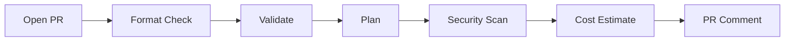
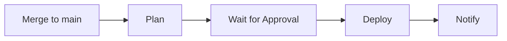

# Jenkins Server Terraform Infrastructure

Deploy a production-ready Jenkins CI/CD server on AWS with automated workflows, security scanning, and approval gates.

## 🚀 Quick Start

terraform/
├── modules/
│   ├── vpc/
│   │   ├── main.tf
│   │   ├── variables.tf
│   │   └── outputs.tf
│   ├── security_group/
│   │   ├── main.tf
│   │   ├── variables.tf
│   │   └── outputs.tf
│   ├── ec2_jenkins/
│   │   ├── main.tf
│   │   ├── variables.tf
│   │   ├── outputs.tf
│   │   └── scripts/
│   │       └── jenkins_install.sh
│   ├── s3_bucket/
│   │   ├── main.tf
│   │   ├── variables.tf
│   │   └── outputs.tf
│   └── iam_role/
│       ├── main.tf
│       ├── variables.tf
│       └── outputs.tf
├── providers.tf
├── backend.tf
├── variables.tf
├── main.tf
└── outputs.tf

**New to this project?** → See **[QUICK-START.md](QUICK-START.md)**

**Setting up CI/CD?** → See **[WORKFLOWS.md](WORKFLOWS.md)**

**Deploying manually?** → See **[DEPLOYMENT-GUIDE.md](DEPLOYMENT-GUIDE.md)**

## ✨ Key Features

- ✅ **Automated CI/CD** - Deploy on PR merge with approval gates
- ✅ **Security Scanning** - tfsec + Checkov on every PR
- ✅ **Production Ready** - Least privilege IAM, KMS encryption, monitoring
- ✅ **Cost Optimized** - ~$150/month for production (free tier available)
- ✅ **Well Documented** - Comprehensive guides for all scenarios

## 📋 CI/CD Workflow

This repository uses **decomposed workflows** for better control:

### Pull Request Workflow


- Runs on all PRs affecting `terraform/**`
- Validates changes without deploying
- Posts plan, security results, and cost to PR
- No infrastructure changes made

### Deployment Workflow


- Runs on merge to `main`
- Requires manual approval (production environment)
- Deploys infrastructure changes
- Provides Jenkins URL in output

See **[WORKFLOWS.md](WORKFLOWS.md)** for detailed workflow documentation.

## Overview

This Terraform project provisions a complete Jenkins infrastructure on AWS, including:
- **Jenkins EC2 Instance** running on Ubuntu 20.04 LTS
- **IAM Role & Instance Profile** for secure S3 access
- **Security Group** with SSH and web UI access controls
- **S3 Bucket** for Jenkins artifacts storage
- **Automated Installation** via user data script

The infrastructure is organized using a modular architecture for reusability and maintainability.

## Architecture

```
┌─────────────────────────────────────────────┐
│           AWS Cloud (us-east-1)             │
│                                             │
│  ┌──────────────────────────────────────┐  │
│  │      Default VPC                     │  │
│  │                                      │  │
│  │  ┌────────────────────────────────┐ │  │
│  │  │  Jenkins EC2 Instance          │ │  │
│  │  │  - Ubuntu 20.04 LTS            │ │  │
│  │  │  - Jenkins (auto-installed)    │ │  │
│  │  │  - IAM Instance Profile        │ │  │
│  │  │  - Security Group (SSH, 8080)  │ │  │
│  │  └────────────────────────────────┘ │  │
│  │             │                        │  │
│  └─────────────┼────────────────────────┘  │
│                │                            │
│                ▼                            │
│  ┌────────────────────────────────────┐    │
│  │  S3 Bucket (Jenkins Artifacts)     │    │
│  │  - Private ACL                     │    │
│  │  - IAM Policy Attached             │    │
│  └────────────────────────────────────┘    │
└─────────────────────────────────────────────┘
```

## Module Structure

```
terraform/
├── main.tf                          # Root module - orchestrates modules
├── variables.tf                     # Root-level input variables
├── outputs.tf                       # Root-level outputs
├── providers.tf                     # AWS provider configuration
├── backend.tf.example               # Remote backend configuration template
├── setup-backend.sh                 # Script to create S3 + DynamoDB backend
├── terraform.tfvars.example         # Example variable values
├── README.md                        # This file
└── modules/
    ├── jenkins/                     # Jenkins server module
    │   ├── main.tf                  # EC2, Security Group, S3
    │   ├── variables.tf             # Module inputs
    │   ├── outputs.tf               # Module outputs
    │   ├── data.tf                  # Data sources (AMI, VPC, subnets)
    │   ├── user-data.sh             # Jenkins installation script
    │   └── README.md                # Module documentation
    └── iam-instance-profile/        # IAM module
        ├── main.tf                  # IAM role, policy, instance profile
        ├── variables.tf             # Module inputs
        ├── outputs.tf               # Module outputs
        └── README.md                # Module documentation
```

## Prerequisites

Before deploying this infrastructure, ensure you have:

1. **Terraform** >= 1.2 installed ([Download](https://www.terraform.io/downloads))
2. **AWS CLI** configured with valid credentials ([Setup Guide](https://docs.aws.amazon.com/cli/latest/userguide/cli-chap-configure.html))
3. **AWS Account** with appropriate permissions:
   - EC2 (create instances, security groups)
   - IAM (create roles, policies, instance profiles)
   - S3 (create buckets)
   - VPC (read default VPC and subnets)
4. **SSH Key Pair** created in AWS for instance access
5. **Your Public IP** in CIDR format (find with `curl ifconfig.me`)

## Remote State Backend (Optional)

For production use and team collaboration, configure remote state storage using S3 with DynamoDB locking.

### Benefits of Remote State

- **Team Collaboration**: Multiple team members can work on the same infrastructure
- **State Locking**: Prevents concurrent modifications that could corrupt state
- **State History**: S3 versioning provides automatic state history
- **Security**: Encrypted state storage in S3
- **Disaster Recovery**: State is backed up and recoverable

For detailed backend documentation, see [BACKEND.md](./terraform/BACKEND.md).

### Backend Setup

1. **Edit the setup script with your values:**
   ```bash
   vim terraform/setup-backend.sh
   # Update BUCKET_NAME with a globally unique name
   ```

2. **Run the setup script:**
   ```bash
   cd terraform
   ./setup-backend.sh
   ```

   This creates:
   - S3 bucket with versioning, encryption, and public access blocking
   - DynamoDB table for state locking with point-in-time recovery

3. **Configure backend:**
   ```bash
   cp backend.tf.example backend.tf
   vim backend.tf
   # Update bucket name, key path, region, and DynamoDB table
   ```

4. **Migrate existing state (if applicable):**
   ```bash
   terraform init -migrate-state
   ```

### Local State (Default)

If you skip the backend setup, Terraform uses local state files (`terraform.tfstate`). This works fine for:
- Individual development
- Testing and learning
- Non-production environments

**Note**: Local state files are automatically ignored by `.gitignore` to prevent accidental commits.

## Quick Start

### 1. Clone the Repository

```bash
git clone https://github.com/your-username/redLUIT_Jan2026_JenkinsServer-TF.git
cd redLUIT_Jan2026_JenkinsServer-TF/terraform
```

### 2. Configure Variables

```bash
# Copy the example variables file
cp terraform.tfvars.example terraform.tfvars

# Edit with your actual values
vim terraform.tfvars
```

**Required variables:**
- `public_ip` - Your public IP in CIDR format (e.g., `203.0.113.25/32`)
- `jenkins_s3_bucket_name` - Globally unique S3 bucket name

### 3. Initialize Terraform

```bash
terraform init
```

This downloads required providers and initializes the modules.

### 4. Review the Plan

```bash
terraform plan
```

Review all resources to be created (~8 resources).

### 5. Deploy Infrastructure

```bash
terraform apply
```

Type `yes` to confirm. Deployment takes 2-3 minutes.

### 6. Access Jenkins

After deployment completes:

```bash
# Get Jenkins URL
terraform output jenkins_public_ip
# Access Jenkins at: http://<public_ip>:8080

# SSH to the instance
ssh -i ~/.ssh/your-key.pem ubuntu@<public_ip>

# Retrieve initial admin password
sudo cat /var/lib/jenkins/secrets/initialAdminPassword
```

## Input Variables

| Variable | Description | Type | Default | Required |
|----------|-------------|------|---------|----------|
| `aws_region` | AWS region to deploy resources | `string` | `"us-east-1"` | No |
| `public_ip` | Your public IP for SSH access (CIDR format) | `string` | - | Yes |
| `jenkins_instance_type` | EC2 instance type for Jenkins | `string` | `"t2.micro"` | No |
| `jenkins_s3_bucket_name` | Unique name for artifacts S3 bucket | `string` | - | Yes |
| `environment` | Environment name (dev, staging, prod) | `string` | `"dev"` | No |
| `jenkins_port` | Port for Jenkins web UI | `number` | `8080` | No |
| `tags` | Additional tags for all resources | `map(string)` | `{}` | No |

## Outputs

| Output | Description |
|--------|-------------|
| `jenkins_public_ip` | Public IP address of Jenkins server |
| `artifacts_bucket` | Name of Jenkins artifacts S3 bucket |
| `jenkins_instance_id` | EC2 instance ID |
| `jenkins_sg_id` | Security group ID |
| `jenkins_iam_role_arn` | IAM role ARN |

## Security Considerations

### Network Security
- **SSH Access**: Restricted to `public_ip` variable (your IP only)
- **Jenkins UI**: Open to `0.0.0.0/0` on port 8080
  - **Production Recommendation**: Restrict to office/VPN IP ranges
  - Configure in `modules/jenkins/main.tf:18`
- **Egress**: Allows all outbound traffic (required for package installation)

### IAM Security
- **Least Privilege**: IAM role grants only S3 access to artifacts bucket
- **Instance Profile**: Created automatically (fixes missing resource bug)
- **S3 Permissions**: Full access (`s3:*`) to artifacts bucket only
  - **Production Recommendation**: Restrict to specific actions (PutObject, GetObject)

### Data Security
- **S3 Bucket**: Private ACL (not publicly accessible)
- **Credentials**: Never commit `terraform.tfvars` or `*.tfstate` files
- **State Files**: Use remote backend (S3 + DynamoDB) for production
  - See [Remote State Backend](#remote-state-backend-optional) section for setup
  - Provides encryption, versioning, and access control
  - `backend.tf` is automatically ignored by `.gitignore`

### Best Practices
1. Use AWS Secrets Manager for sensitive credentials
2. Enable S3 bucket encryption at rest
3. Enable CloudWatch logging for instance monitoring
4. Configure Jenkins security realm and authorization
5. Regularly update Jenkins and plugins

## Troubleshooting

### Jenkins not accessible after deployment
- **Issue**: Cannot access Jenkins UI at `http://<ip>:8080`
- **Solution**: Jenkins installation takes 2-3 minutes. SSH to instance and check status:
  ```bash
  sudo systemctl status jenkins
  sudo journalctl -u jenkins -f
  ```

### SSH connection refused
- **Issue**: `ssh: connect to host <ip> port 22: Connection refused`
- **Solution**: Verify `public_ip` variable is your actual IP in CIDR format:
  ```bash
  curl ifconfig.me  # Get your IP
  # Update terraform.tfvars with: public_ip = "<your-ip>/32"
  terraform apply
  ```

### S3 bucket name already exists
- **Issue**: `BucketAlreadyExists: The requested bucket name is not available`
- **Solution**: S3 bucket names are globally unique. Change `jenkins_s3_bucket_name` in `terraform.tfvars`

### Terraform validation errors
- **Issue**: `terraform validate` shows errors
- **Solution**: Ensure all required variables are set in `terraform.tfvars`:
  ```bash
  terraform validate
  terraform fmt -recursive
  ```

### Module not found errors
- **Issue**: `Module not installed` error
- **Solution**: Re-initialize Terraform to download modules:
  ```bash
  terraform init -upgrade
  ```

## Customization Examples

### Change Instance Type
Edit `terraform.tfvars`:
```hcl
jenkins_instance_type = "t2.medium"  # 2 vCPU, 4 GB RAM
```

### Restrict Jenkins UI Access
Edit `modules/jenkins/main.tf:18`:
```hcl
cidr_blocks = ["203.0.113.0/24"]  # Your office network
```

### Add Custom Tags
Edit `terraform.tfvars`:
```hcl
tags = {
  Project    = "Jenkins"
  CostCenter = "Engineering"
  Owner      = "DevOps Team"
}
```

### Use Different Region
Edit `terraform.tfvars`:
```hcl
aws_region = "us-west-2"
```

### Custom Jenkins Port
Edit `terraform.tfvars`:
```hcl
jenkins_port = 9090
```

## Maintenance

### Updating Jenkins
SSH to the instance and update:
```bash
sudo apt-get update
sudo apt-get upgrade jenkins
sudo systemctl restart jenkins
```

### Viewing Logs
```bash
# Jenkins logs
sudo journalctl -u jenkins -f

# System logs
sudo tail -f /var/log/syslog
```

### Destroying Infrastructure
To remove all resources:
```bash
terraform destroy
```

**WARNING**: This permanently deletes the EC2 instance and S3 bucket (if empty).

## Modules Documentation

For detailed module documentation, see:
- [IAM Instance Profile Module](./modules/iam-instance-profile/README.md)
- [Jenkins Module](./modules/jenkins/README.md)

## Resources Created

This Terraform configuration creates the following AWS resources:

1. **EC2 Instance** - Jenkins server (Ubuntu 20.04)
2. **Security Group** - Firewall rules for SSH and Jenkins UI
3. **S3 Bucket** - Jenkins artifacts storage
4. **IAM Role** - EC2 assume role policy
5. **IAM Policy** - S3 access permissions
6. **IAM Role Policy Attachment** - Links policy to role
7. **IAM Instance Profile** - Attaches role to EC2 instance

**Total Resources**: ~7-8 resources

## Contributing

Contributions are welcome! Please:
1. Fork the repository
2. Create a feature branch (`git checkout -b feature/improvement`)
3. Commit changes (`git commit -am 'Add improvement'`)
4. Push to branch (`git push origin feature/improvement`)
5. Create a Pull Request

## License

This project is licensed under the MIT License - see the LICENSE file for details.

## Acknowledgments

- Built for the redLUIT January 2026 cohort
- Terraform by HashiCorp
- Jenkins by the Jenkins community

## Support

For issues or questions:
- Open an issue on GitHub
- Review the [Troubleshooting](#troubleshooting) section
- Check module-specific READMEs

---

**Project**: redLUIT_Jan2026_JenkinsServer-TF
**Version**: 2.0.0 (Modularized)
**Last Updated**: January 2026